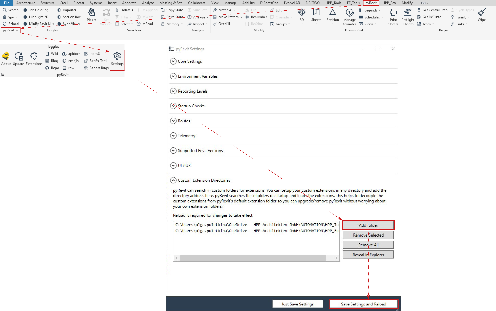

**HPP_tools**

A customer set of Revit tools developed for HPP Architects

**Installation**

1. **Install PyRevit** (https://github.com/eirannejad/pyRevit/releases). If needed, ask BIM department for assistance.

2. Clone this repository if you have a GitHub account. Alternatively, **download** the folder to your computer.

3. Go to the **PyRevit tab**, click **PyRevit button** in the lower-left corner, and select **"Settings."** On the **"Custom Extension Directories"** tab, click **"Add folder"** and select folder that contains the **HPP_tools extension**. Press **"Save Settings and Reload."**

4. You should now be able to see HPP_Tools loaded in your Tab menu.

Developed by Olga Poletkina 

- olga.poletkina@hpp.com
- olga.poletkina@gmail.com